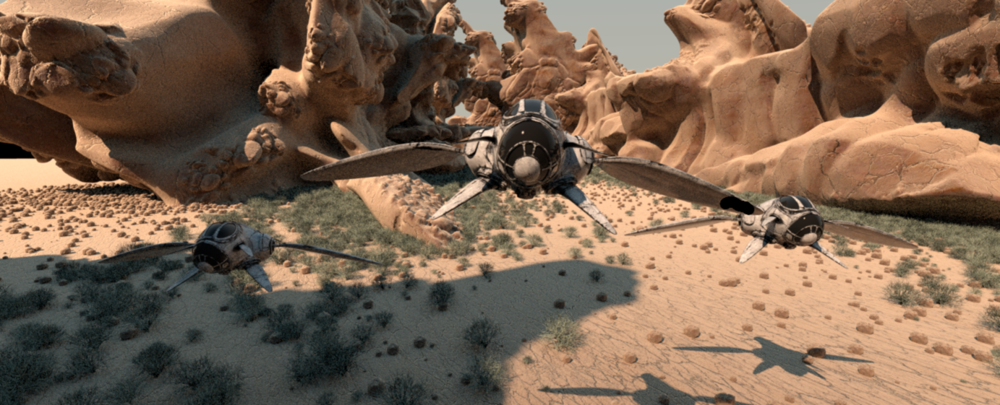
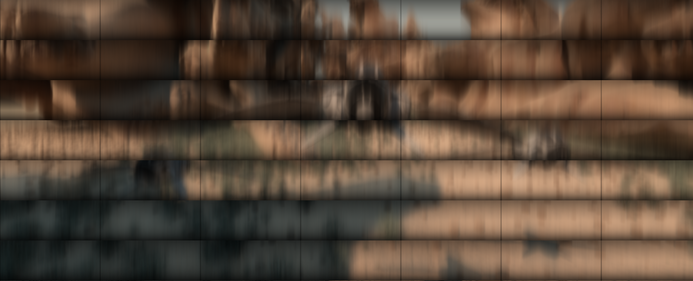
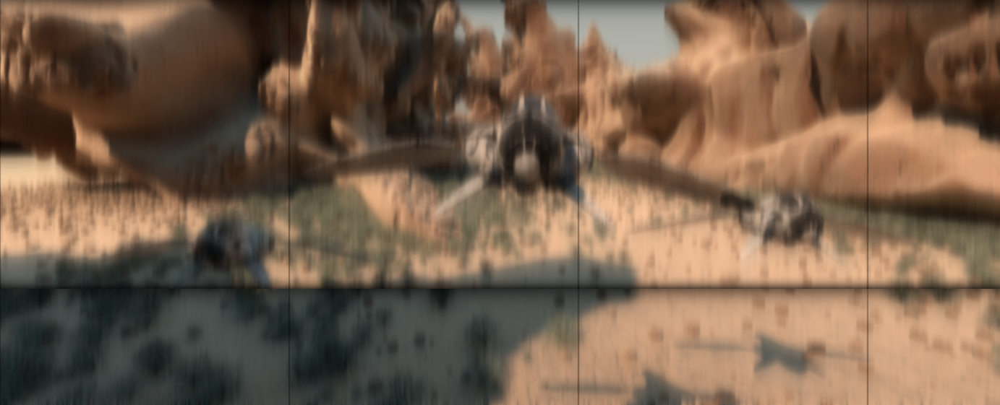

# 24B Bitmap reader/writer and gaussian blur filter #

How to use :

	1- Compile :

		$> make

		OR

		$> make debug

	2- Run :

		usage:
			gbfilter input_file output_file kernel_size tile_width tile_height

		example:
			gbfilter my_image.bmp my_result.bmp 50.2 64 64

		description:
			input_file		24-bit BMP input image file.
			output_file		24-bit BMP output image file.
			kernel_size		set in pixel or sub-pixel the size of the kernel.
			tile_width		set the width of the tile
			tile_height		set the height of the tile

### Before Blur ###

### After Blur ###

### kernel = 20  w = 100 h = 50 ###

### kernel = 10  w = 400 h = 400 ###

